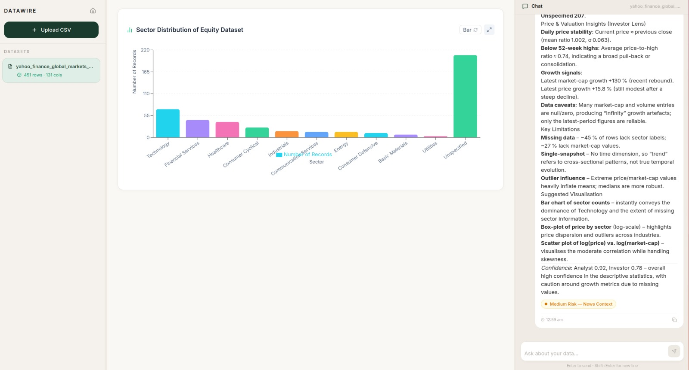
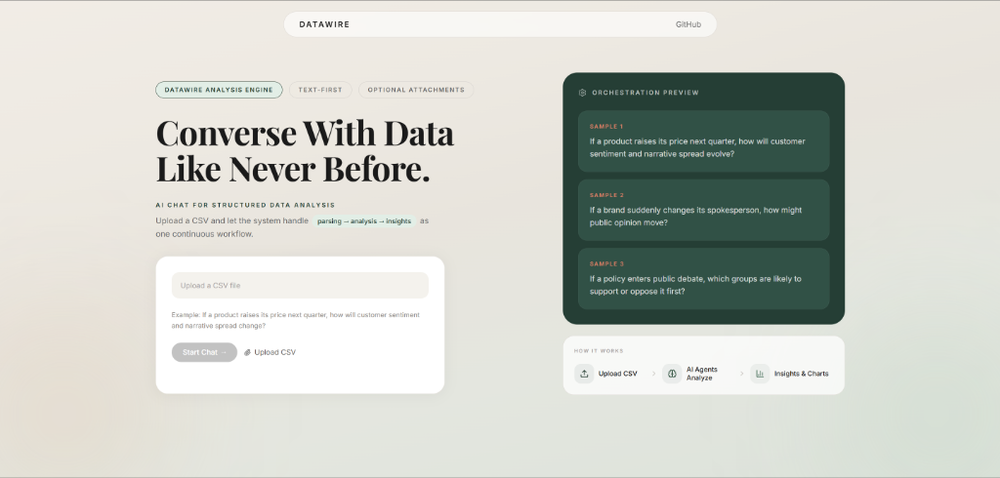
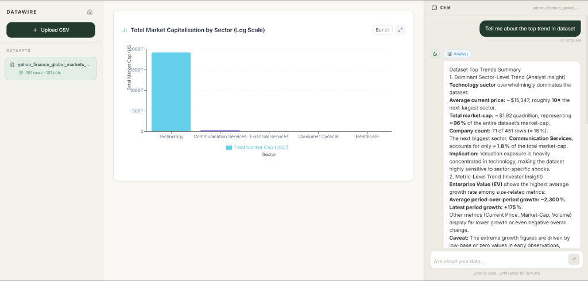
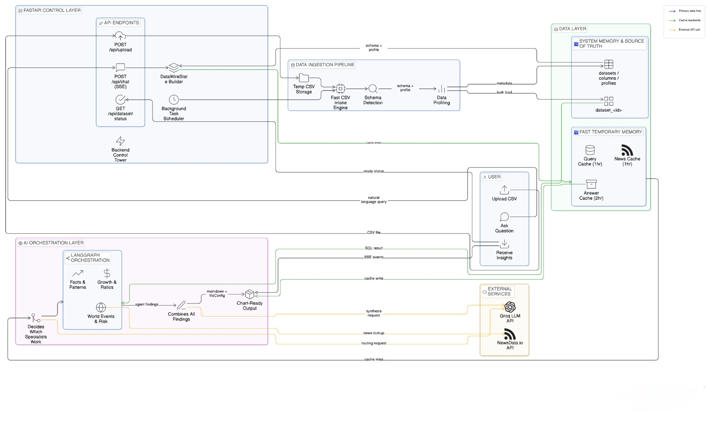

# Data-Wire





## Live Demo
**Access the platform here:** [https://data-wire-gray.vercel.app/](https://data-wire-gray.vercel.app/)

> **Note on Processing Time:** When you ask a question, please allow **10-15 seconds** for the AI to generate a response. This intentional delay is the time required for our multi-agent architecture (Analyst, Investor, Geopolitical agents) to run deep analytical pipelines, perform statistical reasoning, and produce highly accurate, robust insights and visualizations.

## Overview
Data-Wire is a full-stack, multi-agent AI data analytics platform. Upload any CSV file, ask questions in plain English, and receive real-time AI-powered insights with auto-generated visualizations. The platform eliminates the need for specialized data science skills — making advanced data analysis accessible to business users, analysts, and anyone working with data.

## Features
- **CSV Data Ingestion:** Upload CSV files for automated profiling and analysis.
- **Natural Language Queries:** Ask plain English questions about the uploaded data.
- **Multi-Agent Pipeline:** LangGraph orchestrates specialized AI agents (Analyst, Investor, Geopolitical) that debate and synthesize insights.
- **Smart Routing:** Simple queries are routed to a single agent; complex queries trigger the full multi-agent debate — optimizing API usage.
- **Real-time Streaming:** Agent progress and analysis are streamed back via Server-Sent Events (SSE) with live status indicators.
- **Auto-generated Visualizations:** Dynamic charts (bar, line, area, scatter, pie, composed, map, table) are generated based on the AI's analysis using Recharts.
- **External Context:** The Geopolitical agent retrieves real-time news via the NewsData API to correlate data patterns with world events.
- **Redis Caching:** SQL query results and full workflow outputs are cached to minimize redundant API calls.

## Architecture & System Design Decisions



```
┌─────────────────┐     SSE Stream       ┌─────────────────────────────────────────┐
│   React/Vite    │◄───────────────────► │             FastAPI Backend             │
│   Frontend      │     POST /api/chat   │                                         │
│                 │     POST /api/upload │  ┌─────────┐   ┌──────────────────────┐ │
│  ┌───────────┐  │                      │  │ Brain   │──►│ Agent Nodes          │ │
│  │LeftPanel  │  │                      │  │ Router  │   │(LangGraph Resilience)│ │
│  │CenterPanel│  │                      │  └─────────┘   └──────────┬───────────┘ │
│  │RightPanel │  │                      │                           │             │
│  └───────────┘  │                      │  ┌────────────────────────▼───────────┐ │
│                 │                      │  │  Synthesizer (Gemini 2.5 Flash)    │ │
│                 │                      │  └────────────────────────────────────┘ │
└─────────────────┘                      └──────────┬───────────┬──────────────────┘
                                                    │           │
                                         ┌──────────▼──┐   ┌────▼───────────┐
                                         │  Supabase   │   │ Upstash Redis  │
                                         │  Postgres   │   │ (TLS Caching)  │
                                         └─────────────┘   └────────────────┘
```

### Key Architectural & Design Decisions

#### 1. Native Gemini 2.5 Flash & 5-Key Round-Robin Rotation
* **LLM Engine Migration**: Replaced third-party LLM abstractions with native Google Gemini 2.5 Flash (`langchain-google-genai`).
* **5-Key Round-Robin Rotation**: Implemented a thread-safe round-robin key pool (`itertools.cycle` + `threading.Lock`) across 5 Gemini API keys, multiplying free-tier API rate limits up to **75 RPM**.
* **Strict JSON Schema Structured Output**: Eliminated unstable fallback chains in favor of Gemini's native `method="json_schema"` for zero-schema-drift structured output.
* **Prefill & Prompt Caching Optimization**: Structured system prompts with a "Stable First, Dynamic Last" layout, enabling Gemini's implicit context caching to bypass prefill computation on repeated queries.

#### 2. Agent-Level Fault Isolation & Degraded Modes
* **Resilient Multi-Agent Graph**: Wrapped individual agent execution in try/except boundaries inside `agents/workflow.py`.
* **Partial Pipeline Recovery**: If a specific agent hits a tool exception, timeout, or external API limit, it safely returns a degraded finding (`confidence=0.0`). The Master Synthesizer aggregates remaining healthy agent insights instead of failing the entire request.

#### 3. High-Performance CSV Ingestion (DuckDB + Postgres COPY)
* **Sub-Second Profiling**: Uses DuckDB in-memory engine to profile and clean uploaded CSVs in milliseconds.
* **Bulk PostgreSQL Ingestion**: Uses raw `psycopg2` `COPY STDIN` streams to bulk-insert clean rows into dynamically created PostgreSQL tables (`dataset_<uuid>`).

#### 4. Infrastructure & Memory Hardening (Render 512MB RAM)
* **Lazy Loading**: Deferred heavy data science imports (`ydata-profiling`) inside function execution scope, reducing server boot-time RAM usage by **~200MB** and speeding up startup by 4×.
* **Single-Worker Concurrency**: Configured Uvicorn `--workers 1` in `render.yaml` to prevent RAM multiplication across multi-process workers on free hosting.
* **Self-Healing Startup Cleanup**: Added an automated lifespan startup routine in `main.py` that checks for datasets stuck in `"processing"` for >10 minutes (caused by server restarts) and auto-resets them to `"error"`.
* **Graceful Redis Fallback**: Upstash Redis queries are executed over TLS (`rediss://`). If Redis is unreachable, the system logs the failure and gracefully bypasses caching without interrupting agent execution.

### Agent Specializations
| Agent | Role | Tools |
|---|---|---|
| **Analyst** | Statistical analysis, hypothesis testing, forecasting | `query_database`, `get_statistics`, `calculate_forecast` |
| **Investor** | Financial metrics, growth trends, scenario modelling | `query_database`, `calculate_trends`, `compute_ratios` |
| **Geo-Politics** | News correlation, risk classification, external context | `query_database`, `search_news` |

## Tech Stack
- **Frontend:** React 19, Vite, Tailwind CSS, Recharts, React-Markdown, react-simple-maps.
- **Backend:** FastAPI, Python 3.11+, Uvicorn, SSE-Starlette, structlog.
- **AI Engine:** Google Gemini 2.5 Flash (`langchain-google-genai`), LangGraph, LangChain.
- **Data Ingestion & Analytics:** DuckDB, Pandas, ydata-profiling, SciPy, psycopg2.
- **Database & Cache:** Supabase (PostgreSQL via asyncpg/psycopg2), Upstash Redis (TLS).
- **External Services:** NewsData.io API.
- **Deployment:** Render (Backend), Vercel (Frontend).

## Install and Run Instructions

### Prerequisites
- Python 3.11+
- Node.js 18+ and npm
- API keys for Groq, Upstash Redis, NewsData API, and a Supabase connection URL.

### 1. Clone the Repository
```bash
git clone https://github.com/your-username/data-wire.git
cd data-wire
```

### 2. Backend Setup
```bash
cd backend
python3 -m venv .venv
source .venv/bin/activate  # Windows: .venv\Scripts\activate
pip install -r requirements.txt
cp .env.example .env
```

### 3. Frontend Setup
```bash
cd ../frontend
npm install
npm run dev
```

### 4. Access the Application (Local)
- **Frontend:** `http://localhost:5173`

Press **Ctrl+C** in the terminal to stop both servers.

## Usage Examples

### Using the Platform
Once the application is running at `http://localhost:5173`:
1. **Upload Data:** Drag and drop a `.csv` dataset into the upload zone.
2. **Processing:** Wait briefly for the backend to ingest and profile the data using DuckDB.
3. **Ask a Question:** Type a query into the chat interface, for example: *"Show me the trend of sales over the last 12 months."*
4. **View Insights:** The LangGraph agents will analyze the data, stream their thought process/explanations back to you, and dynamically render a visualization (like a line or bar chart).

### Example API Calls
You can test the backend API directly via the Swagger UI available at `http://localhost:8000/docs`.

**Data Upload Endpoint:**
```bash
curl -X 'POST' \
  'http://localhost:8000/api/upload' \
  -H 'accept: application/json' \
  -H 'Content-Type: multipart/form-data' \
  -F 'file=@your_dataset.csv'
```

**Health Check:**
```bash
curl -X 'GET' 'http://localhost:8000/health'
```

## Architecture Notes
The system utilizes a React/Vite web client communicating with a Python FastAPI backend. The frontend consumes Server-Sent Events (SSE) to display responses piecemeal as they are generated. The backend processes the CSV with DuckDB for fast analytics, securely queries an LLM routing intent, and delegates tasks to a LangGraph multi-agent pipeline. Redis is used to preserve transient state while Supabase persists metadata.

## Limitations
- Only CSV file format is currently supported for data upload.
- Gemini free-tier rate limits apply per key, sustained heavy usage may still encounter quota throttling.
- The NewsData.io free tier may rate-limit intensive geopolitical correlation queries.

## Future Improvements
- Support for additional file formats (Excel, JSON, Parquet).
- Expanding the number of personas for deeper, domain-specific predictions.
- Ability to interact directly with a specific agent during conversations.
- More adaptive reasoning where agents evolve based on data patterns over time.
- Debate rounds between agents for higher-confidence outputs.
